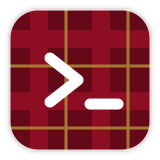
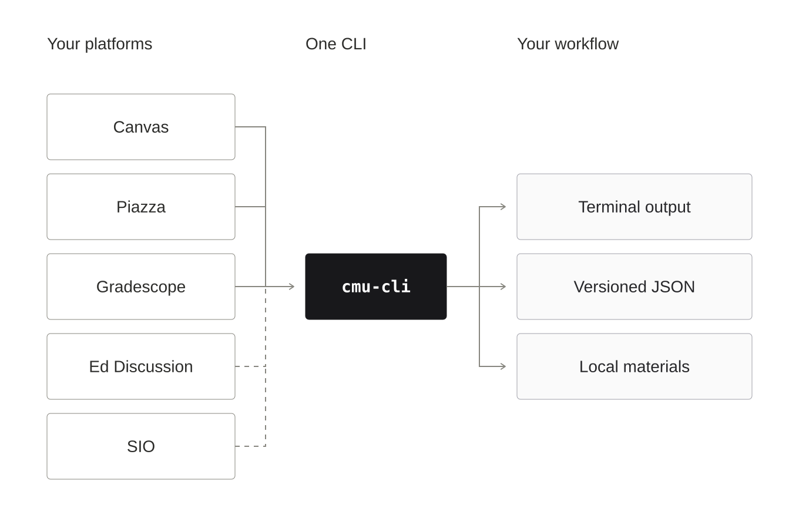

<p align="center">
  
</p>

<h1 align="center">CMU CLI</h1>

<p align="center">
  <em>Your coursework spans five platforms. Your workflow shouldn't have to.</em>
</p>

<p align="center">
  <a href="https://github.com/leejamesss/cmu-cli/actions/workflows/ci.yml"></a>
  
  
  
</p>

A deadline in Canvas. A clarification on Piazza or Ed. A submission in Gradescope.
Your schedule in SIO. **Stop reopening every tab just to figure out what needs doing.**

**CMU CLI** brings coursework reads into your terminal: check assignments, read
course discussions, and keep Canvas materials organized locally. Use readable
terminal output day to day, or `--json` to build your own workflow.



## Install and try it

**Python 3.10+ · macOS or Linux.** Install directly from public GitHub over HTTPS—no
GitHub account, Git installation, or PyPI release needed. Use a virtual environment
to keep your system Python untouched:

```sh
python3 -m venv ~/.venvs/cmu-cli
. ~/.venvs/cmu-cli/bin/activate
python -m pip install "https://github.com/leejamesss/cmu-cli/archive/refs/heads/main.zip"
cmu-cli demo
```

**No account or credentials needed for the demo.** It runs offline with synthetic
assignments, creates readable indexes, and shows a material being downloaded then
reused on the next sync. Temporary files are cleaned up automatically.
[See the walkthrough and generated output →](docs/walkthrough.md)

Run `cmu-cli demo --json` to inspect the structured result. In a new terminal,
activate the same environment with `. ~/.venvs/cmu-cli/bin/activate`.
For a pinned install, replace `refs/heads/main.zip` with `<full-commit-SHA>.zip`.

## Put it to work

Create a configuration, then replace the example Canvas origin, course IDs and
storage directory with your own using the [setup guide](docs/provider-cli.md):

```sh
cmu-cli config init --output cmu-cli.json
cmu-cli --config cmu-cli.json config validate
cmu-cli --config cmu-cli.json doctor
```

These checks run offline. Connect your account through an
[explicit browser session](docs/browser-auth.md) or an
[externally provisioned Canvas token](docs/auth.md). Keep credentials out of config.

With access configured, replace `DEMO-101` below with your configured course code:

```sh
# What's due, and what have I submitted?
cmu-cli --config cmu-cli.json assignments --course DEMO-101

# What did the instructor announce?
cmu-cli --config cmu-cli.json announcements --course DEMO-101

# Keep Canvas materials and readable indexes in my course folder
cmu-cli --config cmu-cli.json sync --course DEMO-101

# Read the configured Piazza class feed
cmu-cli --config cmu-cli.json posts --course DEMO-101

# Use coursework data in a script
cmu-cli --config cmu-cli.json assignments --course DEMO-101 --json
```

`sync` writes to your configured local folder; add `--metadata-only` to skip material
downloads while keeping metadata and indexes. Store exports privately.

## What you can do

| Platform | Useful commands | Setup |
|---|---|---|
| **Canvas** | `courses`, `assignments`, `quizzes`, `announcements`, `materials`, `sync` | [Canvas setup](docs/provider-cli.md#canvas) |
| **Gradescope** | Assignment and submission states through `assignments` | [Course URL + browser session](docs/provider-cli.md#piazza-and-gradescope) |
| **Piazza** | Class feed through `posts` | [Class URL + browser session](docs/provider-cli.md#piazza-and-gradescope) |
| **Ed Discussion** | `ed courses`, `ed threads`, `ed thread`, `ed replies`, `ed search` | [API token](docs/ed.md#authentication-and-origins) |
| **SIO** | `sio schedule`, `sio waitlist-history` | [Browser setup and rendered-HTML fallback](docs/sio.md) |

For example, after setting `CMU_CLI_ED_TOKEN` through your secret-management workflow:

```sh
cmu-cli ed courses --json
# Replace 12 with an Ed course ID from the result
cmu-cli ed search --course-id 12 --query deadline --json
```

Each platform uses its own authorization. Ed search covers fetched listing text,
not replies; SIO reads the selected semester and historical waitlist entries, not
current queue positions. For live-access requirements and tested scope, see the
[Ed](docs/ed.md) and [SIO](docs/sio.md) guides.

## Built for your terminal—and your scripts

- **Readable at a glance.** Interactive tables distinguish submitted, not submitted
  and unknown states; plain text stays friendly to pipes and `NO_COLOR`.
- **Materials that stay organized.** Canvas sync builds course/term folders and
  Markdown indexes, reusing unchanged downloads.
- **Structured results.** Versioned JSON includes source status and warnings.
  Check both `status` and exit code: **0** completed, **2** failed, **3** partial or
  unavailable. [JSON contract →](docs/json-contract.md)
- **Read coursework without changing it.** No submissions, discussion posts, grade
  changes or enrollment actions. Browser access is opt-in; credentials stay bound
  to their origin. [Security and private exports →](SECURITY.md)

## Help shape the next useful command

**Hit a broken workflow?** [Open a bug report](https://github.com/leejamesss/cmu-cli/issues/new?template=bug_report.md)
with the command, expected result and sanitized error code—never tokens or private
coursework. **Missing something you use every week?**
[Suggest the workflow](https://github.com/leejamesss/cmu-cli/issues/new?template=feature_request.md),
including the platform and the steps you want to replace.

Contributions with immediate value: synthetic fixtures for provider layout changes,
Canvas download edge cases, clearer first-run setup, and terminal output improvements.
[Pick a starting point and run the checks →](CONTRIBUTING.md)

Special thanks to **[@HorizonWind2004](https://github.com/HorizonWind2004)** for
Canvas download fixes, SIO fixtures, Rich terminal output, and the CLI naming,
README and red project mark.

## Go deeper

[Documentation](docs/README.md) · [Configuration](docs/configuration.md) ·
[Provider commands](docs/provider-cli.md) · [Architecture](docs/architecture.md) ·
[Contributing](CONTRIBUTING.md) · [MIT license](LICENSE)

**Upgrading from `cmucw`?** The primary command and distribution are `cmu-cli`;
Python APIs live in `cmu_cli`. `cmucw` and `python -m cmucw` remain launch aliases.
[Migration guide →](docs/migration.md)

---

<sub>An independent, unofficial tool. Not affiliated with, endorsed by, or sponsored by
Carnegie Mellon University. The red mark is this project's own. See
<a href="PROVENANCE.md">code provenance</a>.</sub>
